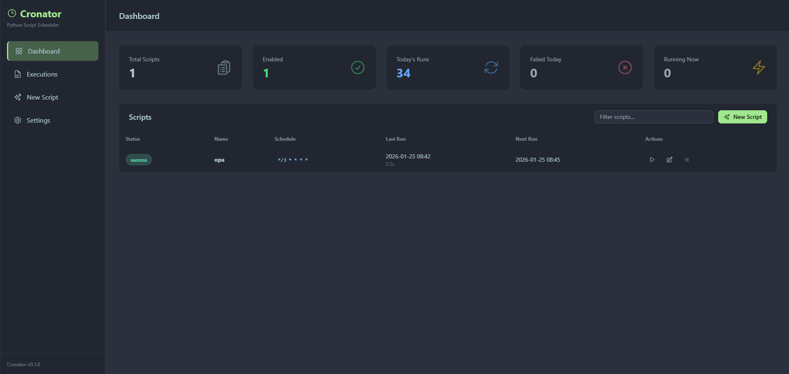
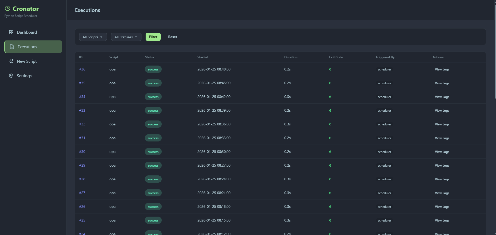
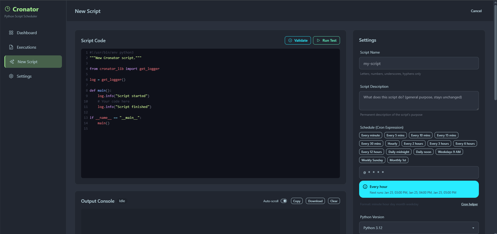
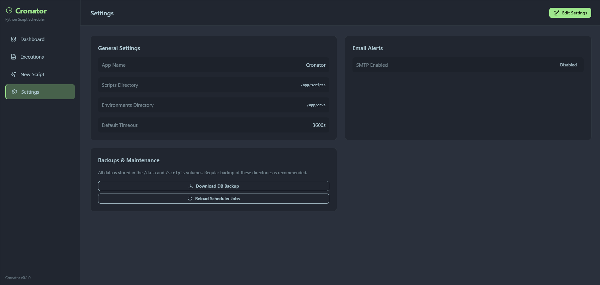

# Cronator

**The home for your recurring Python automations.**

Run, isolate, monitor, and fix scheduled scripts — without crontab hell, broken venvs, or silent failures at 3 AM.

---

Cronator is not an alternative to Airflow or Prefect. It fills the gap between bare `cron` and heavy orchestrators: you have a handful of Python scripts that need to run on a schedule, you want them isolated, observable, and resilient — and you don't want to set up a data platform to get there.

## Screenshots

### Dashboard


_Last executions at a glance — status, duration, output_

### Executions


_Full execution history with filtering and live log streaming_

### Script Editor


_Write, schedule, and configure each script in one place_

### Settings


_SMTP alerts, timeouts, and app-wide configuration_

## Features

- **Python-first** — write a plain Python script, Cronator handles the rest
- **Isolated environments** — every script gets its own `uv` virtualenv; Python version is selectable per script
- **19 built-in templates** — HTTP health checks, database maintenance, backups, notifications, and more
- **Execution history** — every run is stored with stdout, stderr, exit code, duration, and trigger source
- **Live log streaming** — watch output appear in real time over SSE
- **Reliability controls** — per-script retries, retry delay, max retry window, overlap prevention
- **Alerting** — email notifications on failure (SMTP, configurable per script)
- **"Run again" button** — re-run any past execution instantly from the history view
- **Script versioning** — full content stored per execution for reproducibility
- **REST API** — every action available via API with Basic Auth
- **Docker-first** — one `docker compose up` to production; PostgreSQL + daily backups included
- **SQLite for dev** — no database setup needed for local development

## Quick Start

### Production (Docker + PostgreSQL)

```bash
git clone https://github.com/yourusername/cronator.git
cd cronator

cp .env.example .env
# Set POSTGRES_PASSWORD, ADMIN_PASSWORD, SECRET_KEY in .env

docker compose up -d

# Open in browser
open http://localhost:8080
```

Default credentials: `admin` / `admin` — change them in `.env` before going live.

**Included out of the box:**

- PostgreSQL 16 with automatic Alembic migrations on startup
- Daily database backups at 2 AM, retained for 7 days
- Persistent volumes for scripts, environments, logs, and data
- Health checks on all services

### Local Development (SQLite)

```bash
# Install uv if not already installed
curl -LsSf https://astral.sh/uv/install.sh | sh

uv sync
uv run alembic upgrade head
uv run python -m uvicorn app.main:app --reload --port 8080
```

## Writing Scripts

### Via the UI

1. Open `http://localhost:8080`
2. Click **New Script** (or pick one of the 19 templates)
3. Write your code, set a cron schedule, list any pip dependencies
4. Save — it's live immediately

### Script structure

Each script is a plain Python file with a `main()` function:

```python
from cronator_lib import get_logger

log = get_logger()

def main():
    log.info("Starting...")
    # your code here
    log.success("Done!")

if __name__ == "__main__":
    main()
```

## cronator_lib

Every script has access to `cronator_lib` — a lightweight logging and utility library that works the same locally and inside Cronator.

```python
from cronator_lib import get_logger, save_artifact, notify, timer

log = get_logger()

# Log levels — DEBUG/INFO/WARNING go to stdout, ERROR/CRITICAL to stderr
log.info("Fetching data...")
log.warning("Rate limit approaching")
log.error("Connection failed", exc_info=True)
log.success("All records processed!")

# Structured log entry with extra fields
log.with_data("Batch complete", count=1500, duration_ms=823)

# Progress tracking
for i, item in enumerate(items):
    log.progress(i + 1, len(items), "Processing")

# Task lifecycle markers
log.task_start("export")
# ... do work ...
log.task_end("export", success=True)

# Time a code block (logs elapsed time automatically)
with timer("db query"):
    results = db.execute(query)

# Send a manual notification (triggers the same alert channel as failures)
notify("Export complete: 1 500 rows", title="Daily Export")

# Save a file as an execution artifact (appears in the UI)
save_artifact("report.csv", csv_bytes)
```

When running inside Cronator, logs are emitted as structured JSON (one object per line) so the UI can parse and display them. Outside Cronator — in your local terminal — the same calls produce human-readable colored output.

## Templates

Cronator ships with 19 ready-to-use templates:

| Template           | Category     | Description                                               |
| ------------------ | ------------ | --------------------------------------------------------- |
| `api-health-check` | monitoring   | Ping HTTP endpoints, alert on errors or timeouts          |
| `disk-monitor`     | monitoring   | Check disk usage, alert on threshold breach               |
| `ssl-cert-check`   | monitoring   | Alert before SSL certificates expire                      |
| `port-check`       | monitoring   | TCP reachability check (Redis, MySQL, any service)        |
| `dns-check`        | monitoring   | Verify DNS resolution, alert on IP changes                |
| `heartbeat`        | monitoring   | Run job logic and ping a watchdog URL on result           |
| `file-cleanup`     | maintenance  | Delete files older than N days (supports dry-run)         |
| `db-vacuum`        | maintenance  | PostgreSQL VACUUM ANALYZE                                 |
| `pg-backup`        | data         | pg_dump a PostgreSQL database, save as artifact           |
| `mysql-backup`     | data         | mysqldump a MySQL/MariaDB database, save as artifact      |
| `s3-upload`        | data         | Fetch data from a URL and upload to S3-compatible storage |
| `csv-export`       | data         | Fetch JSON from an API and export as a CSV artifact       |
| `http-data-sync`   | data         | Fetch records from a source API and push to a target      |
| `db-query-report`  | data         | Run a SQL query, export results as CSV artifact           |
| `email-report`     | notification | Send an HTML report email via SMTP                        |
| `slack-notify`     | notification | Post to Slack / Discord / Teams via webhook               |
| `telegram-notify`  | notification | Send a Telegram message via Bot API                       |
| `ntfy-notify`      | notification | Push notification via ntfy.sh                             |
| `pushover-notify`  | notification | Push notification via Pushover API                        |

Each template includes inline comments, a working `main()` function, and a `__name__ == "__main__"` guard so it can be tested locally before scheduling.

## Reliability

Each script has individual reliability controls:

| Setting            | Default | Description                                            |
| ------------------ | ------- | ------------------------------------------------------ |
| `retry_count`      | 0       | Number of retry attempts after a failure (0–10)        |
| `retry_delay`      | 60 s    | Seconds to wait between retry attempts                 |
| `max_retry_window` | 3600 s  | Maximum time window within which retries are allowed   |
| `prevent_overlap`  | true    | Skip the run if a previous instance is still executing |

When `prevent_overlap` is enabled and a script is already running, the scheduler creates a `SKIPPED` execution record (with full context) instead of starting a second instance. Skipped executions appear in the history so you can see when and why they were skipped.

Retry state is tracked per execution chain: `attempt`, `first_attempt_at`, and `retries_left` are recorded so you can see exactly what happened in the execution history.

Script-level statistics are updated after every run:

| Field                  | Description                                           |
| ---------------------- | ----------------------------------------------------- |
| `last_success_at`      | Timestamp of the most recent successful execution     |
| `last_failure_at`      | Timestamp of the most recent failed execution         |
| `consecutive_failures` | Counter reset to 0 on success, incremented on failure |

## Configuration

### First run

```bash
cp .env.example .env
# Edit .env: set ADMIN_PASSWORD and SECRET_KEY at minimum
```

`.env` seeds the initial values. After the first start, all settings are stored in the database and can be changed through **Settings → Edit Settings** without restarting the container.

### Environment variables

| Variable                | Default                               | Description                            |
| ----------------------- | ------------------------------------- | -------------------------------------- |
| `ADMIN_USERNAME`        | `admin`                               | Admin login                            |
| `ADMIN_PASSWORD`        | `admin`                               | Admin password — **change this**       |
| `SECRET_KEY`            | `change-me`                           | Encryption key for sensitive settings  |
| `DATABASE_URL`          | SQLite locally / PostgreSQL in Docker | Database connection string             |
| `POSTGRES_PASSWORD`     | `cronator_dev_password`               | PostgreSQL password (Docker only)      |
| `BACKUP_RETENTION_DAYS` | `7`                                   | How many days to keep database backups |
| `SMTP_ENABLED`          | `false`                               | Enable email alerts                    |
| `DEFAULT_TIMEOUT`       | `3600`                                | Default script timeout in seconds      |

See `.env.example` for the full list.

## API

All actions are available via REST API with Basic Auth:

```bash
# List scripts
curl -u admin:password http://localhost:8080/api/scripts

# Create a script
curl -u admin:password -X POST http://localhost:8080/api/scripts \
  -H "Content-Type: application/json" \
  -d '{"name":"my-script","content":"print(1)","cron_expression":"0 * * * *"}'

# Run a script immediately
curl -u admin:password -X POST http://localhost:8080/api/scripts/1/run

# Re-run a specific past execution
curl -u admin:password -X POST http://localhost:8080/api/scripts/1/rerun

# Get execution history
curl -u admin:password http://localhost:8080/api/executions?script_id=1

# Get available templates
curl -u admin:password http://localhost:8080/api/scripts/templates
```

## Database

### PostgreSQL (production)

Alembic migrations run automatically on container start:

```bash
# Check current migration version
docker compose exec cronator uv run alembic current

# View migration history
docker compose exec cronator uv run alembic history
```

### SQLite (development)

```bash
uv run alembic upgrade head    # apply migrations
uv run alembic downgrade -1    # roll back one migration
uv run alembic revision --autogenerate -m "describe change"
```

### Backups

Automated daily backups via the `db-backup` service:

- **Schedule:** every day at 2:00 AM
- **Retention:** 7 days (set via `BACKUP_RETENTION_DAYS`)
- **Format:** `backups/cronator_YYYYMMDD_HHMMSS.sql.gz`

Manual backup:

```bash
docker compose exec db pg_dump -U cronator cronator | gzip > backups/manual_$(date +%Y%m%d).sql.gz
```

Restore:

```bash
docker compose stop cronator
gunzip < backups/cronator_20260125_020000.sql.gz | docker compose exec -T db psql -U cronator cronator
docker compose start cronator
```

## Testing

### Run locally (SQLite)

```bash
uv sync --all-extras
uv run pytest tests/ -v
```

### Run in Docker (PostgreSQL) — recommended

```bash
docker compose -f docker-compose.test.yml up --build --abort-on-container-exit --exit-code-from tests
```

### Test structure

```
tests/
├── conftest.py                        # fixtures, test DB setup
├── unit/
│   ├── test_models.py                 # Script and Execution model tests
│   ├── test_cronator_lib.py           # CronatorLogger, get_logger, save_artifact
│   ├── test_cronator_lib_new.py       # CronatorContext, timer, notify
│   ├── test_script_templates.py       # all 19 templates: fields, syntax, structure
│   ├── test_reliability_schema.py     # Pydantic schema validation for reliability fields
│   └── services/
│       ├── test_scheduler.py          # SchedulerService
│       ├── test_executor.py           # ExecutorService, subprocess env isolation
│       ├── test_alerts.py             # _send_success_alert, _send_failure_alert
│       ├── test_concurrency.py        # per-script lock, _running_scripts
│       └── test_reliability.py        # retries, overlap prevention, stat tracking
└── integration/
    ├── test_api_scripts.py            # /api/scripts CRUD
    ├── test_api_executions.py         # /api/executions
    ├── test_api_settings.py           # /api/settings
    ├── test_api_reliability.py        # templates endpoint, rerun, SKIPPED status
    ├── test_api_artifacts.py          # artifact upload, download, delete
    ├── test_concurrency.py            # concurrent execution with real DB
    ├── test_versioning.py             # script version history and revert
    ├── test_streaming.py              # SSE live log streaming
    ├── test_env_protection.py         # subprocess env isolation (integration)
    └── test_diagnostic.py             # /api/diagnostics endpoint
pg/                                    # same tests re-run against PostgreSQL
    ├── conftest.py                    # testcontainers PostgreSQL fixture
    ├── test_pg_concurrency.py
    ├── test_pg_versioning.py
    └── test_pg_streaming.py
```

Tests use SQLite in-memory by default. The `tests/pg/` suite spins up a real PostgreSQL 16 container via `testcontainers`. In both cases, `SKIP_ALEMBIC_MIGRATIONS=1` is set and the schema is created directly from SQLAlchemy models.

## Security

Before going to production:

- Set strong values for `ADMIN_PASSWORD`, `POSTGRES_PASSWORD`, and `SECRET_KEY` in `.env`
- Never commit `.env` to git (it is in `.gitignore`)
- Put Cronator behind a TLS-terminating reverse proxy (nginx, Caddy, Traefik)
- Sensitive settings (SMTP password, API keys) are encrypted at rest with Fernet
